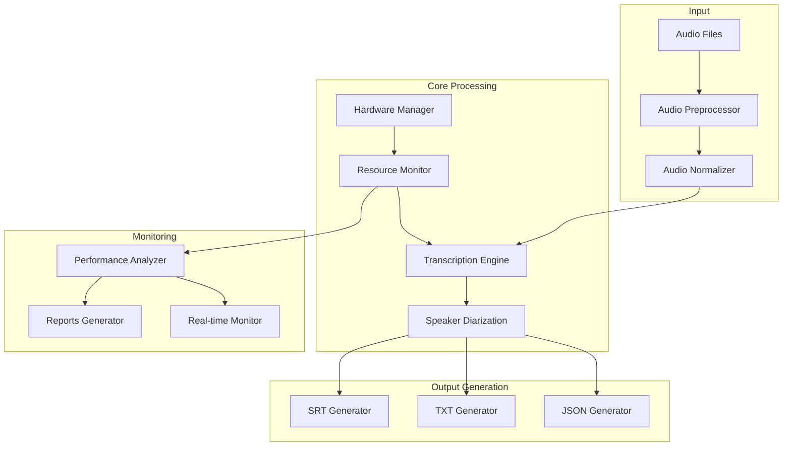
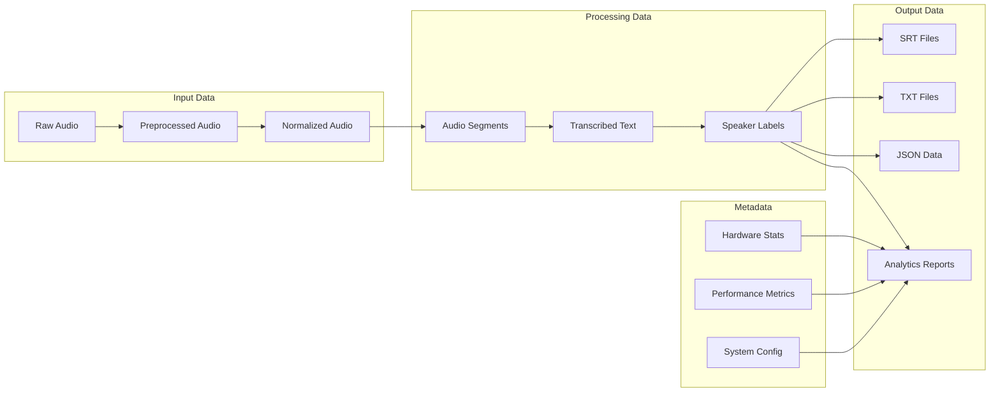
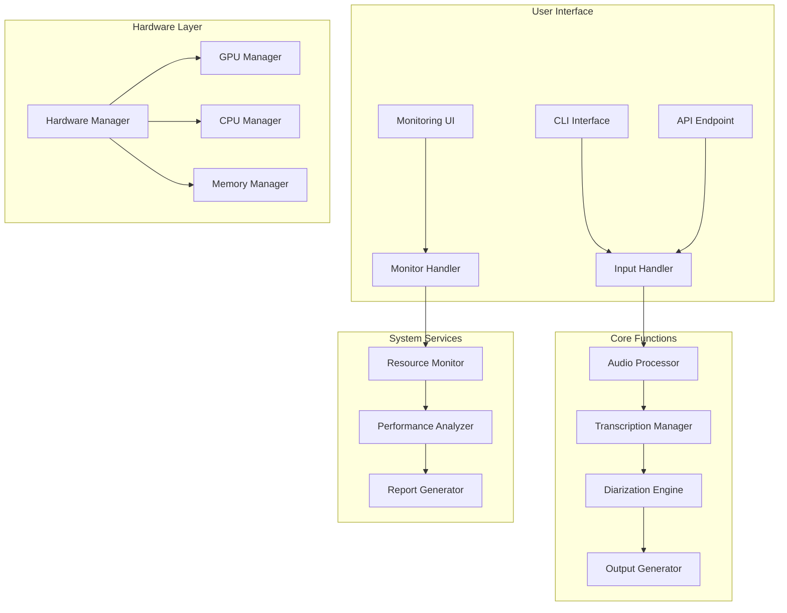

# Smart Whisper Transcriber

A comprehensive audio transcription system that automatically adapts to hardware capabilities, featuring speaker diarization, real-time monitoring, and advanced analytics.

## Overview

Smart Whisper Transcriber is an advanced implementation combining OpenAI's Whisper model with speaker diarization capabilities. The system automatically detects your hardware configuration, selects the most appropriate processing approach, and provides detailed real-time analytics of the transcription process.

## Architecture

### Solution Architecture


### Data Architecture


### Functional Architecture


## Project Structure
Use the following command to view the project structure:
```bash
tree . -I "venv|__pycache__"
```

Expected structure:
```
.
├── Dockerfile
├── Dockerfile.monitoring
├── Readme.MD
├── audio_files/
│   └── .gitkeep
├── data/
│   └── .gitkeep
├── docker-compose.yml
├── main.py
├── models/
│   └── .gitkeep
├── modules/
│   ├── __init__.py
│   ├── apiStructure.py
│   ├── hardwareManager.py
│   ├── monitoring.py
│   ├── systemConfig.py
│   └── transcriptionEngine.py
├── output/
│   ├── reports/
│   └── .gitkeep
└── requirements.txt
```

## Key Features

### Core Capabilities
- 🗣️ Speaker diarization for multi-speaker transcription
- 🧠 Intelligent hardware detection and optimization
- 🚀 Multi-device support (NVIDIA, AMD, Intel, Apple Silicon)
- 📊 Real-time performance monitoring and analytics
- 🌡️ Hardware health monitoring (temperature, power, memory)
- 💪 Automatic failover and fallback mechanisms
- 🔄 Support for multiple Whisper models
- 🌐 RESTful API with webhook support
- 📈 Detailed HTML performance reports

### Processing Features
- 👥 Speaker separation in outputs
- 📝 Multiple output formats (SRT, TXT, JSON)
- 📁 Batch processing capabilities
- 📈 Progress tracking and ETA estimation
- 🔄 Automatic audio preprocessing
- 🎯 Optimal model selection based on hardware

### Monitoring & Analysis
- 📊 Real-time resource utilization displays
- 📈 Performance analytics and reporting
- 🌡️ Temperature and power monitoring
- 💾 Memory usage tracking
- 📉 Processing speed analysis

## Installation

### Prerequisites
- Python 3.10 or higher
- FFmpeg installed on your system
- CUDA-compatible GPU (optional)
- HuggingFace account for speaker diarization

### Local Development Installation
```bash
# Clone the repository
git clone https://github.com/yourusername/smart-whisper-transcriber.git
cd smart-whisper-transcriber

# Create virtual environment
python -m venv venv
source venv/bin/activate  # Linux/Mac
# or
.\venv\Scripts\activate  # Windows

# Install required packages
pip install -r requirements.txt
```

### HuggingFace Authentication Setup
For speaker diarization functionality, you need to authenticate with HuggingFace:

1. Create a HuggingFace account at https://huggingface.co
2. Generate an access token at https://huggingface.co/settings/tokens
3. Set up authentication in one of two ways:

   a. Using environment variables:
   ```bash
   # Create .env file
   echo "HUGGINGFACE_TOKEN=your_token_here" > .env
   ```

   b. Using local token file:
   ```bash
   # Create token file
   mkdir -p ~/.huggingface
   echo "your_token_here" > ~/.huggingface/token
   ```

## Usage

### Command Line Usage
```bash
# Basic usage
python main.py audio_files/your_audio.wav

# With specific model selection
python main.py --model medium audio_files/your_audio.mp3

# Start API server
python main.py --server
```

### API Usage
The system exposes a RESTful API on port 8000:

```bash
# Start transcription job
curl -X POST http://localhost:8000/transcribe \
  -H "Content-Type: application/json" \
  -d '{
    "input_url": "https://example.com/audio.mp3",
    "config": {
      "model_size": "medium",
      "language": "en"
    }
  }'
```

## Output Structure

The system generates multiple output files:
```
output/
├── [filename]_[timestamp]/
│   ├── filename.json         # Complete transcription data
│   ├── filename.txt          # Combined transcript
│   ├── filename_male_speaker.srt    # Male speaker subtitles
│   ├── filename_male_speaker.txt    # Male speaker transcript
│   ├── filename_female_speaker.srt  # Female speaker subtitles
│   └── filename_female_speaker.txt  # Female speaker transcript
└── reports/
    ├── processing_report.json
    ├── report.html
    ├── resource_plot.png
    └── speed_plot.png
```

## Troubleshooting

### Common Issues

1. Speaker Diarization Authentication:
- Error: "No Hugging Face token found in environment"
- Solution: Ensure either `.env` file or `~/.huggingface/token` is properly set up

2. CUDA Issues:
- Error: "Insufficient VRAM"
- Solution: Try using a smaller model size or CPU fallback

3. FFmpeg Missing:
- Error: "FFmpeg not found"
- Solution: Install FFmpeg using your system's package manager

## Contributing

Contributions are welcome! Please feel free to submit a Pull Request. When contributing, please:

1. Fork the repository
2. Create a new branch for your feature
3. Add appropriate tests
4. Update documentation as needed
5. Submit a pull request

## License

This project is licensed under the MIT License - see the [LICENSE](LICENSE) file for details.

## Support

If you encounter any issues or have questions:
1. Check the [Issues](issues) page
2. Review the documentation
3. Create a new issue if needed

## Acknowledgments

- OpenAI for the Whisper model
- HuggingFace for speaker diarization models
- PyTorch team for the deep learning framework
- FFmpeg project for audio processing capabilities

---
Made with ❤️ by Yassine Boumiza